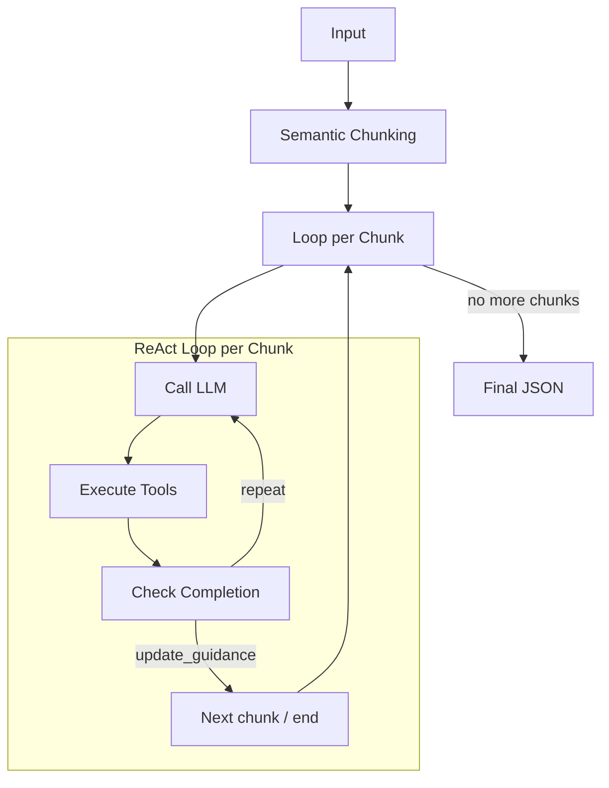

# Text-to-JSON

LangGraph agent for extracting structured data from unstructured text into JSON format.

## Features

- **Semantic Chunking**: Splits text into semantically coherent chunks.
- **Iterative Processing**: ReAct loop (Think-Act-Observe) for accurate extraction
- **Incremental Correction**: Can correct data from previous chunks when new information emerges
- **Optional Schema**: Works with a defined schema or infers structure automatically

## Installation

```bash
# Using uv (recommended)
uv sync

# Or using pip
pip install -e .
```

## Configuration

Create a `.env` file in the project root:

```bash
OPENAI_API_KEY=sk-...
```

## Usage

### CLI

```bash
# Extract from direct text
text-to-json --text "John Doe, 30 years old, works at Acme Corp"

# Extract from file
text-to-json --file document.txt

# Use specific schema
text-to-json --file doc.txt --schema schema.json

# Specify model
text-to-json --file doc.txt --model gpt-4o

# Save formatted result to file
text-to-json --file doc.txt --output result.json --pretty
```

### Python API

```python
from main import extract

# Simple extraction
result = extract(
    text="John Doe, 30 years old, works at Acme Corp as an engineer.",
)
print(result["json_document"])
# {"name": "John Doe", "age": 30, "company": "Acme Corp", "role": "engineer"}

# With defined schema
schema = {
    "type": "object",
    "properties": {
        "employees": {
            "type": "array",
            "items": {
                "type": "object",
                "properties": {
                    "name": {"type": "string"},
                    "age": {"type": "integer"},
                    "company": {"type": "string"}
                }
            }
        }
    }
}

result = extract(
    text=long_document,
    schema=schema,
    model="gpt-4o",  # use more capable model
)

# Access extracted document
json_doc = result["json_document"]

# Access metadata
print(f"Chunks processed: {result['metadata']['total_chunks']}")
```

## Architecture

The agent uses a LangGraph with the following flow:



### Available Tools

| Tool                | Description                                         |
| ------------------- | --------------------------------------------------- |
| `inspect_keys`    | Returns keys of object or length of array at a path |
| `read_value`      | Reads value at specific path (with truncation)      |
| `search_pointer`  | Searches key/value, returns JSON Pointers           |
| `apply_patches`   | Applies RFC 6902 JSON Patch                         |
| `update_guidance` | Finishes chunk and passes state to the next one     |

## Project Structure

```
text-to-json/
├── main.py                    # CLI entry point and extract() function
├── agent/
│   ├── __init__.py
│   ├── graph.py               # LangGraph definition
│   ├── state.py               # AgentState (TypedDict)
│   ├── nodes.py               # Graph node functions
│   └── prompts.py             # Agent system prompt
├── tools/
│   ├── __init__.py
│   ├── inspect_keys.py
│   ├── read_value.py
│   ├── search_pointer.py
│   ├── apply_patches.py
│   └── update_guidance.py
├── chunking/
│   ├── __init__.py
│   └── semantic.py            # SemanticChunker
└── pyproject.toml
```

## License

MIT
